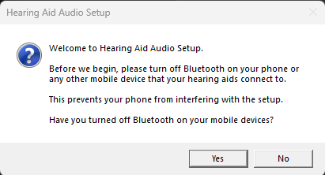
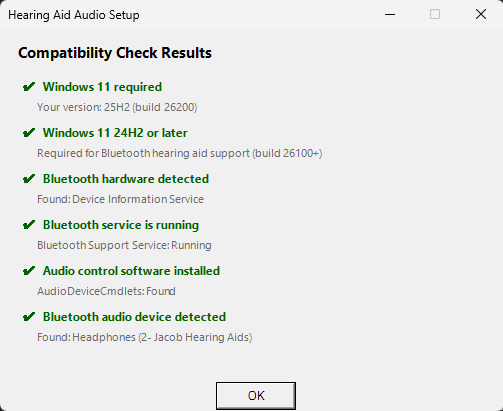
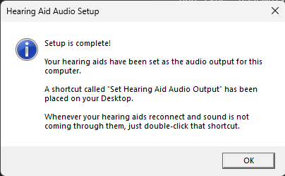

# Hearing Aid Audio Setup for Windows 11

A PowerShell setup wizard that detects paired Bluetooth hearing aids (or any Bluetooth audio device), sets them as the default audio output, and creates a one-click Desktop shortcut to re-enforce that setting whenever needed.

Built for people who use Bluetooth hearing aids with a Windows 11 laptop and need a reliable, repeatable way to route audio to their device after reconnecting.

---

## The Problem

Windows 11 supports Bluetooth LE Audio for hearing aids, but it does not reliably set them as the default audio output when they reconnect — especially when the same hearing aids are also paired to a phone or tablet. This is a known issue affecting Philips, Phonak, Oticon, and other hearing aid brands on Windows 11.

This tool solves that with a simple one-click shortcut.

---

## Requirements

|Requirement|Details|
|---|---|
|Windows 11 24H2 or later|Build 26100+. Required for Bluetooth LE Audio support.|
|Bluetooth LE Audio hardware|Your PC's Bluetooth adapter must support LE Audio. Check Settings → Bluetooth & devices → Devices for a "Use LE Audio when available" toggle. If it is not there, your hardware may not be compatible.|
|Bluetooth LE Audio hearing aids|Your hearing aids must support Bluetooth LE Audio. Check your manufacturer's documentation. Common compatible brands include Philips, Oticon, and ReSound.|
|PowerShell 5.1|Included with Windows 11. No additional install needed.|
|Internet connection|Required during first-time setup only, to install the AudioDeviceCmdlets module from PowerShell Gallery.|

---

## Quick Start

Note: If you run into a "virus scan failed" alert from your bwoser application or Windows 11, please see the [Download Issues document](DOWNLOAD-ISSUES.md) for further instructions.

1. Download both `Run-Setup.bat` and `Setup-BTAudioShortcut.ps1` into the same folder - this is required for the script to work
3. Make sure your hearing aids are connected to your computer via Bluetooth
4. Turn off Bluetooth on your phone or any other device your hearing aids also connect to
5. Double-click **Run-Setup.bat**

The setup wizard will guide you through the rest with simple dialog boxes — no command line interaction required.

1.


2.


3.


---

## What It Does

**During setup:**

- Checks that your system meets all requirements and shows a plain-English result for each check
- Offers to install the required audio control module (AudioDeviceCmdlets from PowerShell Gallery) if it is not already present
- Detects your connected Bluetooth audio device
- If more than one Bluetooth audio device is found, asks you to pick the right one
- Sets your hearing aids as the default audio output and verifies it worked
- Creates a shortcut on your Desktop called **Set Hearing Aid Audio Output**

**The shortcut:**

- Runs silently in the background with no console window
- Sets your hearing aids as both the default playback and default communications device
- Shows a warning popup if the hearing aids are not connected when clicked

---

## Compatibility Check Only

To check whether your system is compatible without making any changes:

```powershell
powershell -ExecutionPolicy Bypass -File Setup-BTAudioShortcut.ps1 -CheckOnly
```

---

## Daily Use

1. Sit down at your computer
2. Turn off Bluetooth on your phone
3. Wait for your hearing aids to connect
4. Double-click **Set Hearing Aid Audio Output** on your Desktop

---

## Troubleshooting

**My hearing aids connect but do not appear during setup**

Your phone may still be connected to them. Turn off Bluetooth on your phone, wait a few seconds, and run setup again.

**The shortcut runs but audio still comes through speakers**

Your hearing aids may have disconnected. Check that they appear under Settings → Bluetooth & devices as connected, then click the shortcut again.

**Setup says my system does not meet requirements**

- If the Windows version check fails, go to Settings → Windows Update and install all available updates
- If no Bluetooth adapter is found, your computer may not have LE Audio-capable Bluetooth hardware. This device may not be compatible without an external Bluetooth adapter
- If no Bluetooth audio device is found, make sure your hearing aids are powered on, in your ears, and connected to this computer before running setup

**The "Use LE Audio when available" toggle is missing from Bluetooth settings**

Your Bluetooth hardware or driver does not support LE Audio. Your hearing aids will not work as a Windows audio device without a compatible adapter or driver update. Contact your PC manufacturer for driver support.

---

## Dependencies

- [AudioDeviceCmdlets](https://github.com/frgnca/AudioDeviceCmdlets) — MIT licensed, installed automatically from PowerShell Gallery during setup

---

## Tested On

- Framework Laptop 16 (AMD Ryzen AI 370)
- Windows 11 24H2
- Philips hearing aids (Bluetooth LE Audio, dual device)

Other hardware combinations that meet the requirements listed above should work. If you test on additional hardware, feel free to open an issue or PR to expand this list.

---

## License

[CC BY-NC 4.0](https://creativecommons.org/licenses/by-nc/4.0/) — Free for personal and non-commercial use with attribution to Deep Coast Engineering.

For commercial licensing, contact: https://github.com/DeepCoastEngineering

---

_Made by [Deep Coast Engineering](https://github.com/DeepCoastEngineering)_
